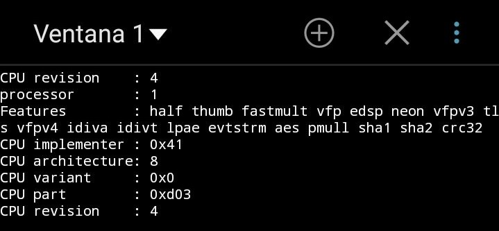

# Introducción a la infraestructura virtual: concepto y soporte físico

## Ejercicio 1
**Consultar en el catálogo de alguna tienda de informática el precio de un ordenador tipo servidor y calcular su coste de amortización a cuatro y siete años. Consultar [este artículo en Infoautónomos sobre el tema.](https://infoautonomos.eleconomista.es/consultas-a-la-comunidad/988/)**

El servidor utilizado de ejemplo es [este](https://www.pccomponentes.com/servidor-hp-proliant-ml110-gen10-intel-xeon-3106-16gb).

Calcular el coste de amortización significa calcular cuanto se debería "ahorrar" al año para que, en el caso de que haya que sustituir el servidor, ya tengamos el dinero para sustituirlo por uno con el mismo precio.

En este caso, el máximo que se puede amortizar como máximo anualmente es del 25%, es decir, en este caso concreto, con un servidor de 1057,02€ (sin IVA), el máximo anual sería de 264,255€.

Calculemos ahora la amortización a 4 y 7 años:

1. A 4 años.

    

    Es decir, la amortización a 4 años supone "ahorrar" 264,25€ al año, que se corresponde con el máximo anual que se puede amortizar.

2. A 7 años.

    

    Para una amortización a 7 años, la cantidad a "ahorrar" es menor, puesto que se reparte entre más años. En este caso, dicha cantidad corresponde a 151,002€ anuales.

## Ejercicio 2
**Usando las tablas de precios de servicios de alojamiento en Internet "clásicos", es decir, que ofrezcan _Virtual Private Servers_ o servidores físicos, y de proveedores de servicios en la nube, comparar el coste durante un año de un ordenador con un procesador estándar (escogerlo de forma que sea el mismo tipo de procesador en los dos vendedores) y con el resto de las características similares (tamaño de disco duro equivalente a transferencia de disco duro) en el caso de que la infraestructura comprada se use solo el 1% o el 10% del tiempo.**

He buscado dos ofertas diferentes para hacer la comparativa, una de [**OVS**](https://www.ovh.es/vps/vps-cloud.xml), la opción de _VPS Cloud 2_, a 19,35€/mes, con 2 cores, 4GB de RAM y 50GB de almacenamiento; y una segunda opción, un poco más cara, de [**TMD Hosting**](https://www.tmdhosting.com/vps-hosting.html), también la segunda opción, _The Original_, a 29,97€/mes, 2 cores, 4GB de RAM y 65GB de almacenamiento SSD.

Ahora haré la comparativa:

1. Uso del 1%.

    * En _OVS_ el precio es de 232,2€ durante los 365 días al año, por lo que hacemos una regla de tres:  

      

      


    O sea, el coste de usarlo solo el 1% de un año (3,65 días, unos 3 días y 15 horas) es de 2,322€.

    * En _TMD Hosting_ el precio anual es de 359,64€. Volvemos a hacer una regla de tres:  

      

      

    Es decir, el coste de utilizar este servicio durante 3 días y 15 horas al año es de 3,596€.

2. Uso del 10%.

    * Comenzamos con _OVS_; al igual que con el 1% solo hay que hacer una regla de tres, en este caso suponiendo que se usa el 10%.  

      

      

    Utilizarlo durante un 10% de un año, que supone unos 36 días y 12 horas aproximadamente, tiene un coste de 23,22€.

    * Por último, en _TMD Hosting_:  

      

      

    El coste del servicio durante un 10% del año es de 35,96€.

## Ejercicio 3
**En general, cualquier ordenador con menos de 5 ó 6 años tendrá estos flags. ¿Qué modelo de procesador es? ¿Qué aparece como salida de esa orden? Si usas una máquina virtual, ¿qué resultado da? ¿Y en una Raspberry Pi o, si tienes acceso, [el procesador del móvil](https://stackoverflow.com/questions/26239956/how-to-get-specific-information-of-an-android-device-from-proc-cpuinfo-file)?**

Mi ordenador personal tiene un procesador de la familia Intel, concretamente un Intel Core i7.

Al usar la orden

```bash
egrep '^flags.*(vmx|svm)' /proc/cpuinfo
```

la salida es la que se muestra en la siguiente captura:


Esta misma línea se repite un total de 8 veces debido al número de CPUs. Como se puede comprobar, el flag de virtualización en el core que se muestra (y en los 7 restantes también) está activo, puesto que de lo contrario el comando no daría lugar a salida alguna. Además, se puede ver que la última "palabra" en rojo corresponde justamente con **vmx**.

Por otro lado, en una máquina virtual (en este caso una que ya tenía instalada y que usa una distribución de Kali-Linux), la salida del mismo comando no se muestra, es decir, en la máquina virtual no está activo el flag como se puede observar en la imagen.


Puesto que no dispongo de una RasPi, he utilizado mi teléfono móvil, un Samsung con 4 cores con un modelo de procesador Samsung Exynos 8890. En este caso, al ejecutar el comando

```bash
cat /proc/cpuinfo
```

no se observa una bandera de virtualización como las mencionadas en el temario.



Ninguna de las banderas activas representan la virtualización, sino otras propiedades relacionadas con operaciones de punto flotante, de enteros...

## Ejercicio 4
1. **Comprobar si el núcleo instalado en tu ordenador contiene este módulo del kernel usando la orden kvm-ok. Alternativamente (o además), usar lscpu como se indica arriba.**
2. **Instalar un hipervisor para gestionar máquinas virtuales, que más adelante se podrá usar en pruebas y ejercicios.**

Utilizando _kvm-ok_ podemos comprobar si el kernel de mi dispositivo puede utilizar la aceleración por hardware. Efectivamente, se puede, como queda reflejado en la siguiente captura:


De la misma forma podemos comprobarlo con el comando

```bash
LC_ALL=C lscpu | grep Virtualization
```

que nos confirma la información que ya habíamos extraído al utilizar _kvm-ok_: el kvm está activo.


El hipervisor instalado no es software libre, pertenece a la Oracle: VirtualBox; es un hipervisor que hemos estado utilizando desde primero de carrera y que por eso es el que he elegido, ya que lo conozco bien y conozco algunos de los problemas que puede dar y cómo arreglarlos.


## Ejercicio 5
**Darse de alta en servicios de nube usando ofertas gratuitas o cupones que pueda proporcionar el profesor.**

Me he dado de alta en _Amazon Web Services_. En la captura se puede apreciar los servicios que ofrece _Amazon_ una vez estás dentro de la cuenta registrada.


## Ejercicio 6
**Darse de alta en una web que permita hacer pruebas con alguno de los sistemas de gestión de nube anteriores.**

Para poder probar los servicios que se ofrecen en _AWS_, _WordPress_ permite desarrollar una página web a través de _AWS_, tal y como se muestra en la siguiente imagen.


Para poder probarlo, me he dado de alta. He creado una stack por defecto para probar como funcionaba. No obstante, hay muchísimas cosas que no entiendo y que simplemente he dejado la opción por defecto. De hecho, hay un error en la creación, tal y como se puede ver en la captura, referente al _Key Name_, el cual ni siquiera me ha dado opción de elegir, así que al finalizar la creación, ha aparecido ese fallo de construcción.


