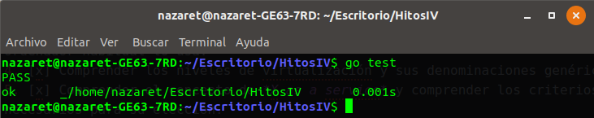
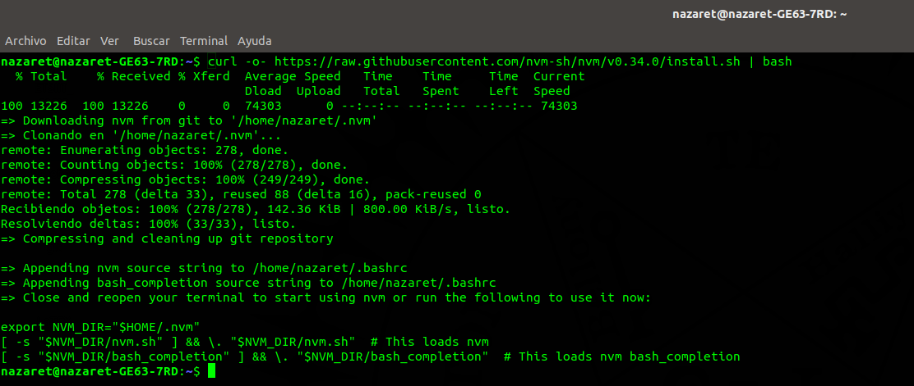
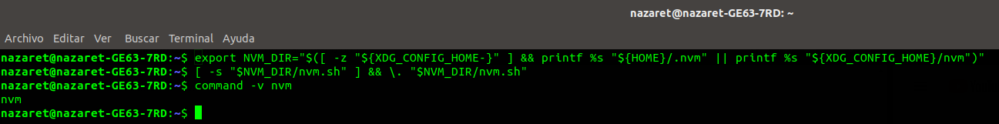
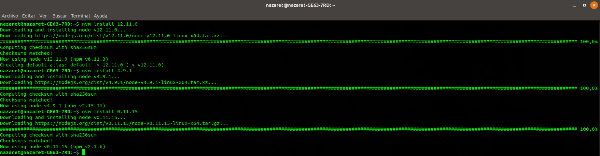

# Desarrollo basado en pruebas

## Ejercicio 1
**Descargar y ejecutar las pruebas de alguno de los proyectos anteriores, y si sale todo bien, hacer un pull request a alguno de esos proyectos con test adicionales, si es que faltan (en el momento que se lea este tema).**

Para llevar a cabo este ejercicio, he utilizado el proyecto de [HitosIV](https://github.com/JJ/HitosIV), y al hacer las pruebas, finalizan correctamente, como se puede observar en la captura.



El test adicional se enviará a través de un pull request al repositorio correspondiente cuando el tema sea leído, tal y como dice el enunciado.

## Ejercicio 2
**Para la aplicación que se está haciendo, escribir una serie de aserciones y probar que efectivamente no fallan. Añadir tests para una nueva funcionalidad, probar que falla y escribir el código para que no lo haga (vamos, lo que viene siendo TDD).**

Se ha implementado un [test](https://github.com/nazaretrogue/Microservicio-multimedia/blob/master/test/aserciones.java) que comprueba si la imagen que se recibe está en el formato correcto, JPEG o JPG. Puesto que ahora mismo no sé exactamente como llegará la imagen al servidor, he planteado una idea en el código que ahora mismo está comentada.

La funcionalidad actual del test consiste en crear una imagen en formato RGB y comprobar si esa imagen recién creada se corresponde con el espacio de color RGB.

Una vez que sepa como se envían exactamente las imágenes al servidor, sabré como extraer la imagen de la petición HTTP y convertirla al tipo correspondiente con el que poder trabajar en el test.

## Ejercicio 4
**Instalar alguno de los entornos virtuales de node.js (o de cualquier otro lenguaje con el que se esté familiarizado) y, con ellos, instalar la última versión existente, la versión mino más actual de la 4.x y lo mismo para la 0.11 o alguna impar (de desarrollo).**

He elegido el entorno *nvm* de node.js para instalar las distintas versiones a convivir en el sistema. Con la ayuda de la [guía de instalación](https://github.com/nvm-sh/nvm#installation-and-update), he instalado *nvm*, tal y como se muestra en las dos imágenes siguientes:




Una vez instalado, pasamos a mostrar las versiones disponibles con el comando

```bash
nvm ls-remote
```
que despliega en la terminal una larga lista de todas las versiones que se pueden instalar. En nuestro caso, elegimos la última versión, que corresponde con la v12.11.0, la más reciente de la minor de la 4.x, en este caso, la v4.9.1, y por último, una versión que esté en desarrollo, en este caso hemos escogido la v0.11.15.

La instalación de todas las versiones en el entorno virtual de node.js se muestra en la imagen.


